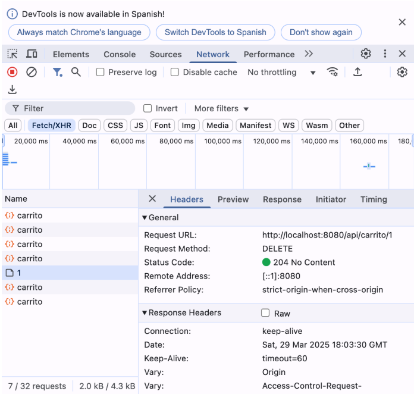
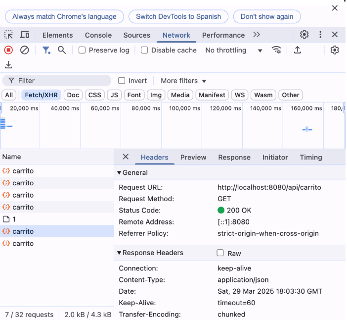
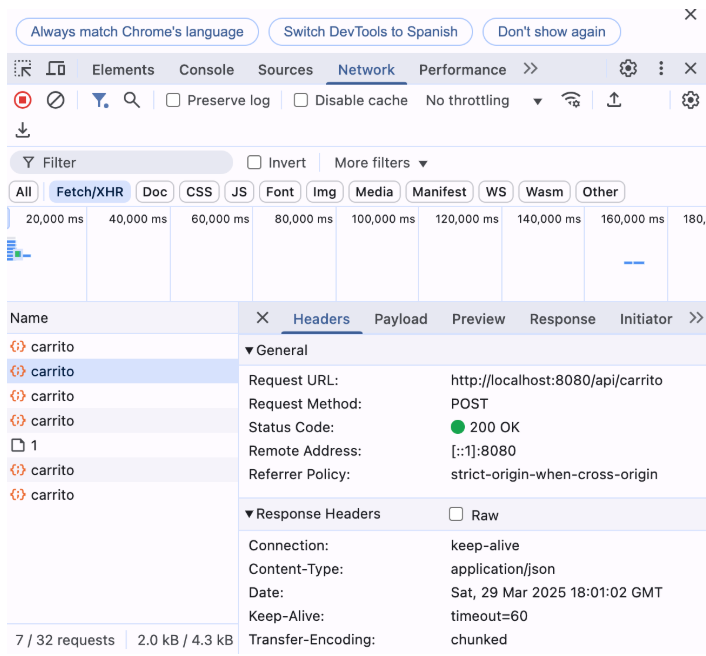

# P4 – API REST para carrito de la compra

| Método HTTP | Ruta                | Cuerpo (JSON)                          | Descripción                                       | Respuesta esperada         |
|-------------|---------------------|----------------------------------------|--------------------------------------------------|-----------------------------|
| **GET**     | `/api/carrito`      | –                                      | Devuelve todos los productos del carrito         | 200 OK                      |
| **POST**    | `/api/carrito`      | `{ nombre, precio, cantidad }`         | Añade un nuevo producto al carrito               | 201 Created / 200 OK        |
| **PUT**     | `/api/carrito/{id}` | `{ nombre, precio, cantidad }`         | Actualiza los datos de un producto por su ID     | 200 OK / 404 Not Found      |
| **DELETE**  | `/api/carrito/{id}` | –                                      | Elimina un producto del carrito por su ID        | 204 No Content / 404 Not Found |

---

## COMPROBACIÓN

